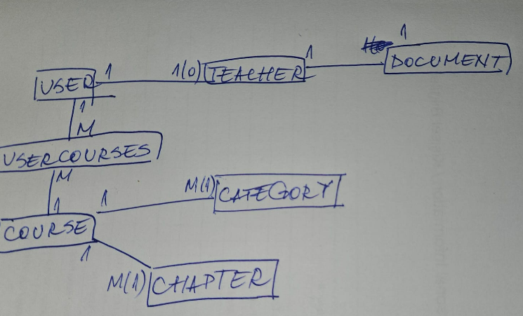

# Course Platform

Course Platform is a web application that allows users to either become teachers or enroll in courses. Admins can approve teacher applications.

## Setup

Follow these steps to set up the project:

1. Clone the repository: `git clone https://github.com/mihaicatalin13/course-platform.git`
2. Navigate to the project directory: `cd course-platform`
3. Install dependencies: `npm install`
4. Create a `.env` file in the root directory and set up your environment variables (see below for more details).
5. Run the application: `npm start`

## Environment Variables

The application uses the following environment variables:

- `DEFAULT_PAGE_INDEX`: used for pagination
- `DEFAULT_PAGE_SIZE`: used for pagination
- `DEFAULT_SORT_BY`: used for sorting
- `DEFAULT_SORT_ORDER`: used for sorting
- `ACCESS_TOKEN_SECRET`: The secret key for signing JSON Web Tokens.
- `REFRESH_TOKEN_SECRET`: The secret key for signing refresh tokens.

## Testing

The tests use [Jest](https://jestjs.io/) as the testing framework and [Supertest](https://github.com/visionmedia/supertest) for making HTTP requests.
Run the tests using the command `npm test`.

